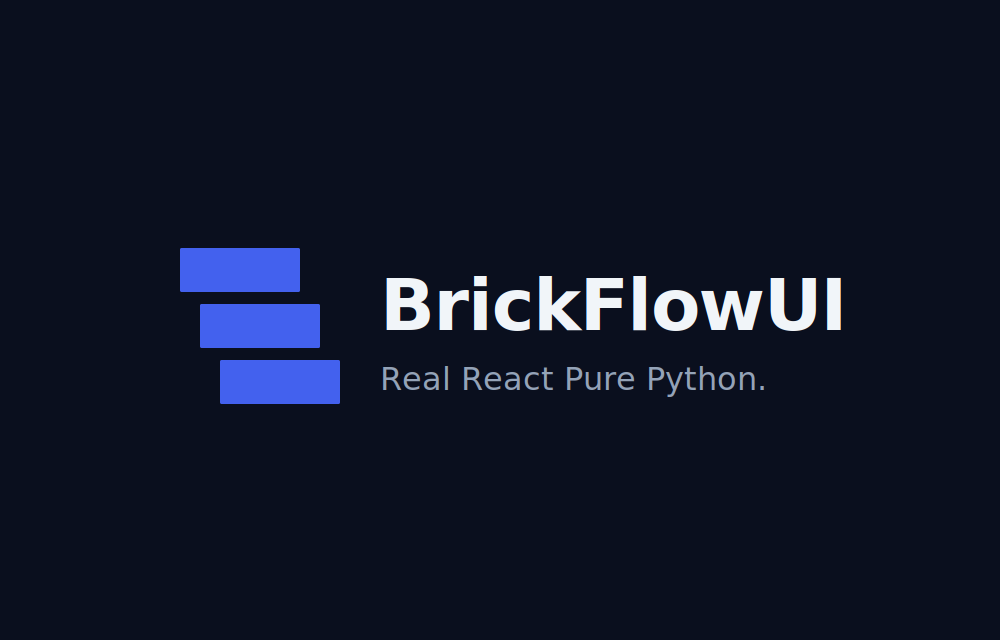
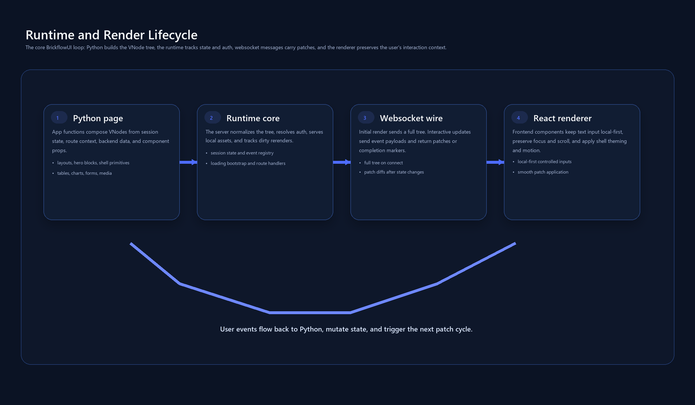



# BrickflowUI

[](https://pypi.org/project/brickflowui/)
[](https://pypi.org/project/brickflowui/)
[](LICENSE)
[](https://ajayaj2000.github.io/brickflowUI/)

BrickflowUI is a Python-first app framework for building dashboards, portals, copilots, landing pages, and secure internal tools with a real frontend runtime behind the scenes.

It is aimed at teams that want to stay in Python while still shipping application surfaces that feel structured, branded, and product-grade.


## At a glance

- Python-first authoring
- dashboards, portals, copilots, and internal tools
- Databricks-friendly deployment
- product-style layouts and workflows
- Lucide icon support across navigation and interactive surfaces
- theming, branding, loading screens, and media support
- documentation and examples built for real teams

Canonical package name: `brickflowui`

## Who it is for

BrickflowUI is a strong fit for:

- data platform teams
- AI application teams
- analytics engineering teams
- internal tools teams
- enterprise engineering groups working on dashboards and portals
- Python teams that want richer UI outcomes without maintaining a separate frontend stack

## Who it is not for

BrickflowUI may not be the right fit if:

- you want a pure frontend framework with full hand-authored React ownership
- you only need a quick notebook demo and do not care about product polish
- your team already has a strong dedicated frontend workflow and wants full JS/TS control everywhere

## Why it exists

Many Python UI frameworks are great for fast demos, but they start to feel restrictive when teams need:

- stronger layout control
- responsive app shells
- better branding
- auth-aware navigation
- workflow-heavy interfaces
- more serious product presentation

BrickflowUI is built for that next step: keeping teams in Python while giving them room to ship applications that feel closer to real product surfaces.

## What you can build

- executive dashboards
- analytics command centers
- data engineering pipeline portals
- Databricks Apps
- secure internal operations tools
- chatbot and copilot workspaces
- landing pages and internal product sites

## What makes it different

- Python-first component authoring with `import brickflowui as db`
- session-scoped reactive state
- multi-page routing and shell patterns
- built-in layouts, forms, overlays, media, tables, charts, workflow components, and chat patterns
- open-source Lucide icon support for navigation, buttons, and shell elements
- light/dark theming, branding tokens, and loading-screen customization
- packaged frontend assets that work in stricter environments like Databricks Apps
- examples and docs aimed at real teams, not just toy demos

## Product shape



## Install

```bash
pip install brickflowui
```

Optional extras:

```bash
pip install "brickflowui[databricks]"
pip install "brickflowui[viz]"
pip install "brickflowui[databricks,viz]"
```

Import:

```python
import brickflowui as db
```

## First app

```python
import brickflowui as db

app = db.App(title="Hello BrickflowUI")

@app.page("/", title="Home")
def home():
    count, set_count = db.use_state(0)
    return db.Column(
        [
            db.Text("Hello BrickflowUI", variant="h1"),
            db.Text(f"Count: {count}"),
            db.Button("Increment", on_click=lambda: set_count(count + 1)),
        ],
        gap=4,
        padding=6,
    )

if __name__ == "__main__":
    app.run()
```

Run it:

```bash
python app.py
```

## Quick start workflow

Scaffold a new app:

```bash
brickflowui new my_app
cd my_app
brickflowui dev
```

If the CLI entrypoint is not available yet:

```bash
python -m brickflowui.cli.main new my_app
```

## Runtime model

BrickflowUI works like this:

1. Python page functions produce a `VNode` tree.
2. The server serializes that tree and sends it to the frontend runtime.
3. The frontend renders the UI and sends interaction events back.
4. Python handlers update state and trigger rerenders.

That gives you a React-style interaction loop while keeping the authoring model in Python.

## Component surface

### Layout and shell

- `Column`
- `Row`
- `Grid`
- `Card`
- `Hero`
- `SectionHeader`
- `StatusStrip`
- `Divider`
- `Spacer`
- `Sidebar`
- `TopNav`
- `Breadcrumbs`

### Inputs, forms, and overlays

- `Button`
- `Input`
- `Select`
- `MultiSelect`
- `Checkbox`
- `Toggle`
- `Slider`
- `DateRangePicker`
- `Form`
- `Modal`
- `Drawer`
- `Popup`

### Data, workflow, and chat

- `Table`
- `Timeline`
- `SparklineStat`
- `Stepper`
- `KanbanBoard`
- `PipelineGraph`
- `ChatMessage`
- `ChatInput`

### Charts and visualization

- `Plot`
- `AreaChart`
- `BarChart`
- `LineChart`
- `DonutChart`
- `ScatterChart`
- `ComposedChart`
- `GaugeChart`
- `RadarChart`
- `Heatmap`
- `FunnelChart`
- `TreeMap`

### Media and embeds

- `Image`
- `Video`
- `Embed`

## Databricks Apps

Minimum `requirements.txt`:

```text
brickflowui>=0.1.13
```

Install from GitHub:

```text
brickflowui @ git+https://github.com/AjayAJ2000/brickflowUI.git@main
```

Minimum `app.yaml`:

```yaml
command:
  - python
  - app.py
```

Packaging rule:

The installed package must include:

- [`brickflowui/frontend/dist/index.html`](https://github.com/AjayAJ2000/brickflowUI/blob/main/brickflowui/frontend/dist/index.html)
- [`brickflowui/frontend/dist/assets/*`](https://github.com/AjayAJ2000/brickflowUI/tree/main/brickflowui/frontend/dist/assets)

If those assets are missing, Databricks Apps often stop at the loading shell.

## Documentation

- [Docs site](https://ajayaj2000.github.io/brickflowUI/)
- [Learn BrickflowUI](https://ajayaj2000.github.io/brickflowUI/learning/)
- [Component Library](https://ajayaj2000.github.io/brickflowUI/components/)
- [Architecture](https://ajayaj2000.github.io/brickflowUI/ARCHITECTURE/)
- [Databricks Apps Guide](https://ajayaj2000.github.io/brickflowUI/DATABRICKS_APPS/)
- [Examples](https://ajayaj2000.github.io/brickflowUI/EXAMPLES/)

## Recommended examples

- [`examples/local_playground/app.py`](https://github.com/AjayAJ2000/brickflowUI/blob/main/examples/local_playground/app.py) for framework validation
- [`examples/component_studio/app.py`](https://github.com/AjayAJ2000/brickflowUI/blob/main/examples/component_studio/app.py) for broad component coverage
- [`examples/acme_analytics_command_center/app.py`](https://github.com/AjayAJ2000/brickflowUI/blob/main/examples/acme_analytics_command_center/app.py) for a product-style shell
- [`examples/clinical_trial_command_center/app.py`](https://github.com/AjayAJ2000/brickflowUI/blob/main/examples/clinical_trial_command_center/app.py) for a regulated-industry style dashboard
- [`examples/secure_internal_tools/app.py`](https://github.com/AjayAJ2000/brickflowUI/blob/main/examples/secure_internal_tools/app.py) for role-aware internal tools

## Vibe coding skills

The repo now includes reusable skill files for AI coding tools that help keep generated BrickflowUI apps aligned with the framework's strengths.

- [`skills/brickflowui-app-starter/SKILL.md`](https://github.com/AjayAJ2000/brickflowUI/blob/main/skills/brickflowui-app-starter/SKILL.md)
- [`skills/brickflowui-data-ai-portal/SKILL.md`](https://github.com/AjayAJ2000/brickflowUI/blob/main/skills/brickflowui-data-ai-portal/SKILL.md)
- [`skills/brickflowui-polish-and-qa/SKILL.md`](https://github.com/AjayAJ2000/brickflowUI/blob/main/skills/brickflowui-polish-and-qa/SKILL.md)
- [`skills/brickflowui-databricks-delivery/SKILL.md`](https://github.com/AjayAJ2000/brickflowUI/blob/main/skills/brickflowui-databricks-delivery/SKILL.md)

Docs walkthrough:

- [Vibe Coding Skills](https://ajayaj2000.github.io/brickflowUI/VIBECODING/)

## Local development

Run the core checks:

```bash
cd frontend
npm ci
npm test -- --run
npm run lint
npm audit --audit-level=high
npm run build
cd ..
python -m pytest -q -p no:cacheprovider
python -m mkdocs build --strict
python -m build
```

See the [Stability Contract](docs/STABILITY.md), [Release Checklist](docs/RELEASE_CHECKLIST.md), and [Publishing Guide](docs/PUBLISHING.md) before cutting a release.

## Open source standards

- [Contributing guide](CONTRIBUTING.md)
- [Code of Conduct](CODE_OF_CONDUCT.md)
- [Security policy](SECURITY.md)
- [Support guide](SUPPORT.md)

## Repository map

```text
brickflowui/
  app.py
  components.py
  server.py
  state.py
  theme.py
  version.py
  frontend/dist/
  cli/
  databricks/

frontend/
  src/
  vite.config.ts

docs/
  learning/
  components/
  ARCHITECTURE.md
  EXAMPLES.md
```

## License

MIT
