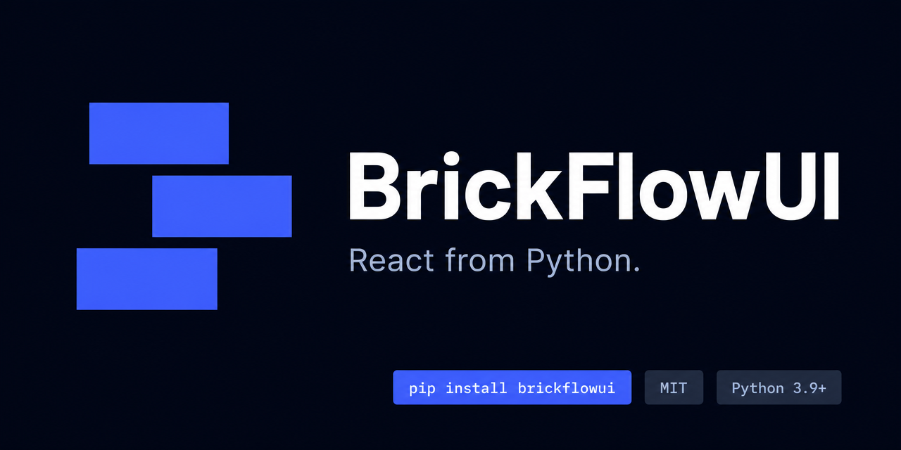
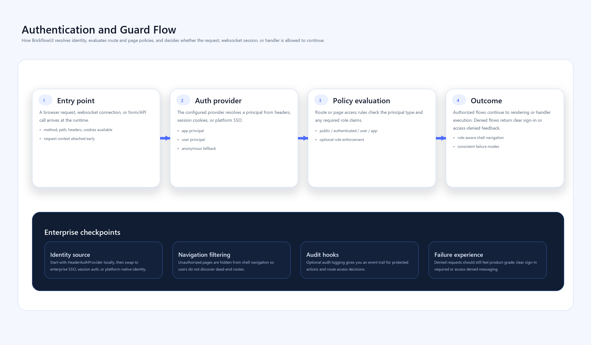
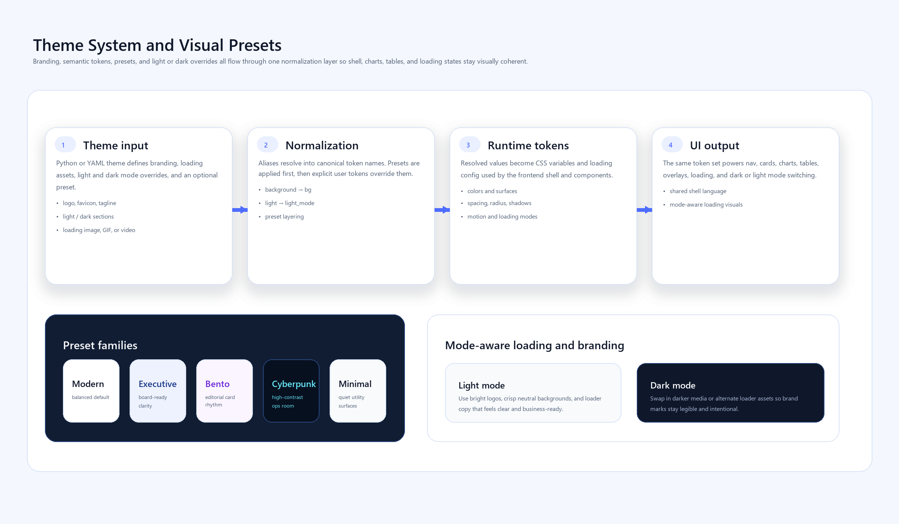
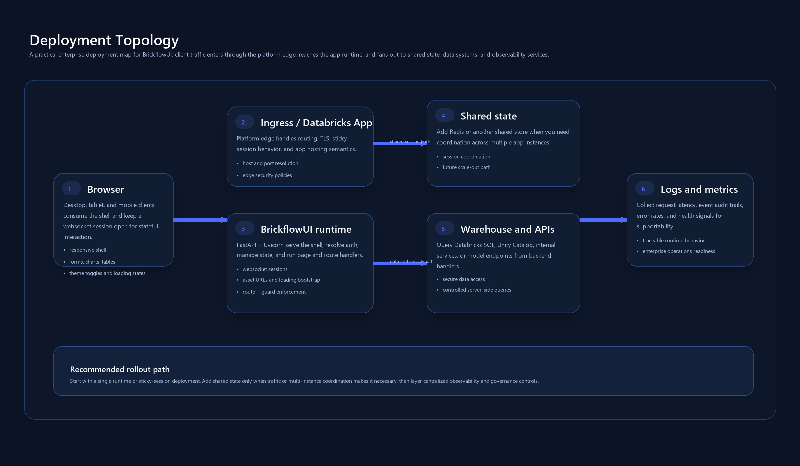

# BrickflowUI

<div class="bf-docs-hero">
  <div class="bf-docs-hero-copy">
    <p class="bf-docs-eyebrow">Python-first internal app platform</p>
    <h1>Build dashboards, portals, copilots, and product-grade internal apps in pure Python.</h1>
    <p>
      BrickflowUI is for teams that want a Python-first authoring experience without giving up
      application shells, structured interactions, branding, responsive layouts, packaged frontend
      assets, or enterprise-style deployment guidance.
    </p>
    <div class="bf-docs-pill-row">
      <span>Dashboards</span>
      <span>Secure internal tools</span>
      <span>Pipeline command centers</span>
      <span>Copilot workspaces</span>
      <span>Databricks portals</span>
    </div>
  </div>
  <div class="bf-docs-hero-panel">
    <div class="bf-docs-kpi">
      <strong>Why teams evaluate it</strong>
      <span>It aims to close the gap between notebook UI speed and custom frontend ambition.</span>
    </div>
    <div class="bf-docs-kpi">
      <strong>What it optimizes</strong>
      <span>Python ownership, reactive state, richer UI surfaces, brand control, and evaluator-friendly docs.</span>
    </div>
    <div class="bf-docs-kpi">
      <strong>Who it serves</strong>
      <span>Data platform teams, analytics builders, internal tool engineers, and regulated enterprise workflows.</span>
    </div>
  </div>
</div>



## Start Here

<div class="bf-docs-card-grid">
  <a class="bf-docs-card" href="./WHY_BRICKFLOWUI/">
    <strong>Why BrickflowUI</strong>
    <span>Understand the product wedge, end users, and where the framework fits against notebook-style tools.</span>
  </a>
  <a class="bf-docs-card" href="./GETTING_STARTED/">
    <strong>Quick Start</strong>
    <span>Install the package, run your first app, and verify the runtime in minutes.</span>
  </a>
  <a class="bf-docs-card" href="./learning/">
    <strong>Learn BrickflowUI</strong>
    <span>Follow the structured curriculum from first principles to a capstone portal build.</span>
  </a>
  <a class="bf-docs-card" href="./API_REFERENCE/">
    <strong>API Reference</strong>
    <span>Review the current public surface, hooks, theme sections, auth helpers, and component categories.</span>
  </a>
  <a class="bf-docs-card" href="./EXAMPLES/">
    <strong>Examples</strong>
    <span>See flagship apps that prove shell design, analytics, media, pipelines, security, and chat workflows.</span>
  </a>
  <a class="bf-docs-card" href="./DATABRICKS_APPS/">
    <strong>Deploy</strong>
    <span>Understand how BrickflowUI packages for Databricks Apps and stricter enterprise environments.</span>
  </a>
</div>

## What A Serious Evaluation Looks Like

If you are evaluating BrickflowUI as a platform rather than casually exploring it, use this path:

1. [Why BrickflowUI](./WHY_BRICKFLOWUI.md)
2. [Architecture](./ARCHITECTURE.md)
3. [Performance And Scalability](./PERFORMANCE.md)
4. [Auth And Security](./AUTH_AND_SECURITY.md)
5. [API Reference](./API_REFERENCE.md)
6. [Examples](./EXAMPLES.md)
7. [Databricks Apps](./DATABRICKS_APPS.md)

## Built-To-Ship Surfaces

<div class="bf-docs-showcase-grid">
  <div class="bf-docs-showcase-card">
    <strong>Analytics command centers</strong>
    <span>Sidebars, KPI cards, premium tables, charts, filters, drilldowns, and theme-aware shells.</span>
  </div>
  <div class="bf-docs-showcase-card">
    <strong>Pipeline operations portals</strong>
    <span>Freshness, DAGs, SLA controls, warehouse views, incidents, and operator-friendly status surfaces.</span>
  </div>
  <div class="bf-docs-showcase-card">
    <strong>Secure internal tools</strong>
    <span>Auth-aware pages, route guards, governed views, deployment notes, and enterprise-style navigation.</span>
  </div>
  <div class="bf-docs-showcase-card">
    <strong>Copilot workspaces</strong>
    <span>Chat UI, assistant workflows, source drawers, structured filters, and media-rich support surfaces.</span>
  </div>
</div>

## Runtime Overview


## Product Areas

<div class="bf-docs-card-grid">
  <a class="bf-docs-card" href="./components/">
    <strong>Component Library</strong>
    <span>Browse grouped component guides and detailed pages for layout, controls, data, navigation, charts, and workflow patterns.</span>
  </a>
  <a class="bf-docs-card" href="./PORTAL_TUTORIAL/">
    <strong>Build A Real Portal</strong>
    <span>Follow a larger SaaS-style app build that connects shells, filters, state, tables, charts, and deployment thinking.</span>
  </a>
  <a class="bf-docs-card" href="./VISUALIZATIONS/">
    <strong>Visualizations And Pipelines</strong>
    <span>Learn the chart, Plotly, pipeline graph, and workflow visualization surface in one place.</span>
  </a>
  <a class="bf-docs-card" href="./LOCAL_DEVELOPMENT/">
    <strong>Local Development</strong>
    <span>Validate runtime behavior, auth patterns, assets, responsiveness, and debugging workflows locally.</span>
  </a>
  <a class="bf-docs-card" href="./FAQ/">
    <strong>FAQ</strong>
    <span>Get direct answers to the questions evaluators and builders ask most often.</span>
  </a>
  <a class="bf-docs-card" href="./RECIPES/">
    <strong>Recipes</strong>
    <span>Find targeted implementation patterns for auth, Databricks SQL, charts, chatbot UI, and deployment flows.</span>
  </a>
</div>

## Enterprise Checkpoints







## Recommended Reading Order

If you are new to the framework, this is the fastest way to build confidence:

1. [Quick Start](./GETTING_STARTED.md)
2. [Learn BrickflowUI](./learning/index.md)
3. [Examples](./EXAMPLES.md)
4. [API Reference](./API_REFERENCE.md)
5. [Local Development](./LOCAL_DEVELOPMENT.md)
6. [Databricks Apps](./DATABRICKS_APPS.md)

## Install

```bash
pip install brickflowui
```

```python
import brickflowui as db
```

## First App

```python
import brickflowui as db

app = db.App(title="Hello BrickflowUI")

@app.page("/", title="Home")
def home():
    count, set_count = db.use_state(0)
    return db.Column(
        [
            db.Text("Hello BrickflowUI", variant="h1"),
            db.Text(f"Count: {count}"),
            db.Button("Increment", on_click=lambda: set_count(count + 1), icon="Plus"),
        ],
        gap=4,
        padding=6,
    )

if __name__ == "__main__":
    app.run()
```
